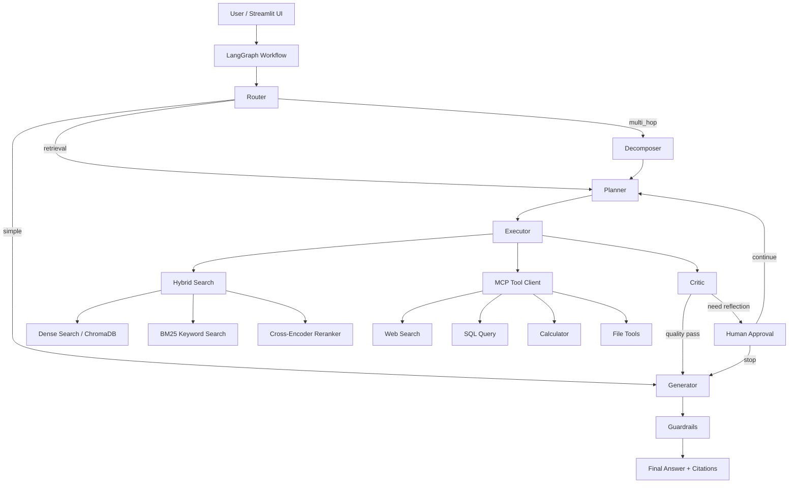

# Enterprise Agentic RAG 面试准备手册

## 1. 项目定位

这个项目不是一个“把大模型接上知识库”的 Demo，而是一个围绕企业级知识问答场景做的 Agentic RAG 系统升级版。它的目标是把文档入库、混合检索、问题分解、工具调用、答案反思、人工审批、引用追踪和幻觉防护串成一条完整闭环。

如果要一句话介绍这个项目，可以这样说：

> 我把一个基础的本地 RAG 知识库，升级成了一个面向生产环境的 Enterprise Agentic RAG 系统，核心增强包括多策略切块、Dense + BM25 混合检索、HyDE / Multi-Query 查询增强、LangGraph 工作流编排、MCP 工具调用、Skill 热插拔、引用追踪、Faithfulness Guardrails 和 RAG 评估闭环。

如果面试官追问“企业级体现在哪”，可以从下面六条展开：

1. 检索链路不再是单一向量检索，而是多阶段检索与重排。
2. 工作流不再是单轮问答，而是可规划、可反思、可人工介入的 Agent 流程。
3. 工具层不再是硬编码函数调用，而是 MCP Client + Skill Registry 的可扩展结构。
4. 文档处理不再是简单按字符切块，而是支持语义切块、父子切块、Late Chunking 等策略。
5. 生成阶段不再只追求“能答”，而是增加引用追踪与幻觉检测。
6. 质量保障不再只靠主观感觉，而是引入 RAGAS 风格评估指标。

---

## 2. 项目 30 秒 / 1 分钟 / 3 分钟讲法

### 2.1 30 秒版本

我做了一个企业级 Agentic RAG 知识库系统。它基于 LangGraph 编排查询路由、问题分解、规划执行、反思评估和最终生成，底层检索采用 BGE-M3 向量检索和 BM25 混合召回，再通过 Cross-Encoder 做精排。同时我增加了 HyDE、多查询扩展、引用追踪、Faithfulness Guardrails、MCP 工具调用和 Skill 热插拔，让系统更接近真实生产环境，而不是简单的问答 Demo。

### 2.2 1 分钟版本

这个项目最初只是一个本地知识库问答系统，我把它系统性升级成了 Enterprise Agentic RAG。首先在文档入库侧，我引入了语义切块、父子切块和递归切块等多种策略，并在向量库侧增加了内容哈希去重和 BM25 稀疏索引。其次在检索侧，构建了 Dense + Sparse + RRF + Cross-Encoder 的多阶段检索管线，并支持 HyDE 和 Multi-Query 这种查询增强技术。再往上，在 Agent 工作流层用 LangGraph 做了 Router、Decomposer、Planner、Executor、Critic、Human Approval、Generator 的图式编排，使系统具备复杂问题拆解、反思迭代和人工审批能力。最后在答案生成环节加入引用标注和 Faithfulness 校验，并补上了离线评估、MCP 工具客户端、Skill Registry 等企业级能力。

### 2.3 3 分钟版本

这个项目的核心价值不是“接了一个大模型”，而是做了一个从文档治理到答案可信的全链路升级。

第一层是文档入库能力。很多 Demo 是把整篇文档直接扔进向量库，这会导致召回粒度粗、上下文噪声大。我这里把文档解析统一到了统一解析器，支持 PDF、图片、Word，PDF 走 PyMuPDF，扫描件走 PaddleOCR，Word 用 python-docx。切块上实现了四种策略：递归切块作为通用基线，语义切块通过句向量相邻距离判断边界，父子切块用于兼顾召回精度和上下文完整性，Late Chunking 预留给后续更细粒度的后聚合检索。

第二层是检索能力。系统不再依赖单一路径，而是同时做 Dense 检索和 BM25 稀疏检索，用 RRF 融合两路结果，然后再通过 BGE Reranker 做精排。对于复杂或表述模糊的问题，又增加了 HyDE 和 Multi-Query，提高召回鲁棒性。这样做的原因是，向量检索擅长语义泛化，但对专有名词、缩写和精确词匹配不稳定；BM25 刚好补齐这一点。

第三层是 Agent 工作流能力。用 LangGraph 搭建了 Router、Decomposer、Planner、Executor、Critic、Generator 的状态图。简单问题可以直接生成，复杂问题先拆解成子问题，再做规划与执行。如果执行后的答案质量不达标，系统会进入 Critic 节点，必要时触发 Human-in-the-Loop，让人决定是否继续迭代。相比单条链式调用，这种图结构更适合复杂任务。

第四层是可信答案能力。我在最终生成阶段加入了引用标注，要求每个事实性陈述都关联来源编号；然后再通过 Faithfulness Check 判断答案是否真正有上下文支撑。如果置信度不够，就打出风险提示。除此之外，还增加了 RAGAS 风格的 Faithfulness、Relevancy、Context Precision 评估逻辑，便于后续做离线对比实验和线上监控。

第五层是工程化扩展能力。工具调用统一走 MCP Client，支持超时、重试、限流和指标采集；Skill 层引入注册表和热插拔机制，可以把向量检索、网络搜索、SQL 查询等能力统一成技能对象。这样后续扩展新能力时，不需要把逻辑继续堆进主流程。

---

## 3. 系统架构图



你在面试里可以把架构分成四层：

1. 接入层：Streamlit UI。
2. 编排层：LangGraph 状态机。
3. 检索与工具层：Hybrid Search + MCP + Skills。
4. 可信性层：Citation + Faithfulness + Evaluation。

---

## 4. 端到端实现流程

## 4.1 文档入库流程

```text
上传文件
-> UnifiedDocumentParser 解析文档
-> 提取文本 / 表格 / 图片描述
-> 选择 chunk strategy
-> 生成 chunk + metadata
-> 计算 content hash 做去重
-> 写入 ChromaDB
-> 重建 / 更新 BM25 索引
```

详细讲法：

1. 用户在 Streamlit 上传 PDF 或 DOCX。
2. ingestion 模块调用统一解析器。
3. PDF 使用 PyMuPDF 抽取文本块和图片，图片可走 OCR；Word 使用 python-docx；扫描件走 PaddleOCR。
4. 解析结果被送入 chunking 模块，根据配置选择 semantic、parent_child、recursive、late 等策略。
5. 每个 chunk 都附带 metadata，包括 source、page、chunk_index、strategy、token_count、content_hash。
6. 向量库写入前先依据 content_hash 去重，避免重复入库。
7. 文本嵌入进入 ChromaDB，同时在内存里维护 BM25 索引，用于关键词召回。

## 4.2 查询执行流程

```text
用户提问
-> Router 判断 simple / retrieval / multi_hop / tool_call
-> 如果 multi_hop，先做 query decomposition
-> Planner 生成结构化 plan
-> Executor 按 step_type 执行 retrieval / web / sql / calc
-> Critic 评估当前答案质量
-> 必要时 Human Approval 决定是否继续反思
-> Generator 生成带引用答案
-> Guardrails 检查 faithfulness
-> 返回最终结果和来源
```

你可以强调这里不是“一次 prompt 解决所有问题”，而是显式拆成多个可观测节点，每个节点都能单独调试和演化。

## 4.3 检索增强流程

```text
原始 query
-> 可选 Multi-Query 生成多个查询变体
-> 可选 HyDE 生成假设文档
-> 多个 query 并行做 Dense Search + BM25 Search
-> RRF 融合结果
-> Cross-Encoder Rerank
-> TopK 返回给 Generator
```

---

## 5. 模块拆解与模型选型

| 模块 | 作用 | 主要技术 / 模型 | 为什么这样选 |
| --- | --- | --- | --- |
| Streamlit UI | 对话、上传、参数控制 | Streamlit | 快速构建内部知识库 UI，开发成本低 |
| Workflow Orchestration | 路由、规划、执行、反思、人工审批 | LangGraph | 比简单 Chain 更适合多节点状态流转 |
| LLM 生成 / 规划 / 评估 | 规划、分解、生成、Judge | 默认走 SiliconFlow OpenAI 兼容接口，模型为 DeepSeek-V2.5 | 兼顾中文能力、推理能力和成本 |
| Embedding | 文本向量化 | BAAI/bge-m3 | 适合中英混合、多功能检索场景 |
| Reranker | 精排 | BAAI/bge-reranker-v2-m3 | 在召回后提升排序质量 |
| Vector Store | 向量存储 | ChromaDB | 本地部署方便，适合中小规模知识库验证 |
| Sparse Retrieval | 关键词检索 | In-Memory Okapi BM25 | 补足 Dense 对精确词和专有名词的不足 |
| OCR | 扫描件识别 | PaddleOCR | 中文 OCR 生态成熟，CPU 环境可运行 |
| PDF 解析 | PDF 文本和图片提取 | PyMuPDF | 速度和可控性较好 |
| Word 解析 | DOCX 提取 | python-docx | 工程成本低，适合知识库入库 |
| 工具协议层 | Tool 调用 | MCP Client | 为后续外部服务 / Tool Server 集成做标准化接口 |
| Skill 生命周期 | 技能注册、热插拔、度量 | SkillRegistry | 方便扩展和工程治理 |

### 5.1 生成模型怎么讲

代码里的 LLMFactory 统一管理多家 Provider，包括 OpenAI、DeepSeek、SiliconFlow、Moonshot、HuggingFace、ModelScope、Ollama。当前默认重点场景是 SiliconFlow 的 OpenAI 兼容调用，默认模型配置是 DeepSeek-V2.5。

面试里可以这样说：

> 我没有把模型写死在业务逻辑里，而是做了工厂抽象，把 Provider、API Key、Base URL、默认模型都收敛到配置层。这样做的价值是后续切换闭源 API、本地 Ollama 或 HuggingFace Endpoint 时，不需要重写主流程。

### 5.2 为什么选 BGE-M3

推荐回答：

1. 它对中英文混合场景更友好。
2. 在检索任务里表现稳定，适合企业知识库常见的术语问答。
3. 与 BGE 系列 Reranker 组合起来，工程一致性更好。

### 5.3 为什么还要 Reranker

Dense + BM25 的目标是“尽量召回”，不是最终排序最优。Reranker 是在候选集合较小之后，用 Cross-Encoder 直接看 query-document 对的相关性，通常比纯 embedding 相似度更准。

---

## 6. 企业级升级亮点

## 6.1 多策略切块

当前系统支持四种切块方式：

1. Recursive：作为稳健兜底策略，基于 chunk_size 与 overlap 递归切分。
2. Semantic：先按句子切分，再计算相邻句向量的 cosine distance，根据分位点断开。
3. Parent-Child：保留层级结构，用于粗粒度召回、细粒度定位。
4. Late：为更细粒度的后聚合检索预留能力。

面试时要突出一点：

> 切块不是越小越好。太小会丢上下文，太大又会稀释相关性。企业知识库里要根据文档类型、问答模式和召回目标选策略。

## 6.2 Dense + Sparse 混合检索

单独用向量检索，会在精确词匹配、缩写词、编号、专有名词上翻车。单独用 BM25，又会在语义泛化和同义改写上不足。所以这里同时保留两条链路：

1. Dense Search 负责语义召回。
2. BM25 负责关键词召回。
3. 最后通过 RRF 做融合。

RRF 的公式可以这样记：

```text
score(d) = Σ weight_i / (k + rank_i(d))
```

它的好处是：

1. 不要求两路分数同尺度。
2. 更关注排名稳定性。
3. 对多路召回融合更鲁棒。

## 6.3 HyDE 与 Multi-Query

HyDE 的思想是：先让 LLM 根据问题“假设性写一段可能正确的答案”，再把这段文本向量化去检索。这样做在用户问题过短、术语不完整、表达抽象时，常常能提高 Dense 召回命中率。

Multi-Query 的思想是：让 LLM 为同一个问题生成多个同义改写版本，缓解词汇失配问题。

这两者的共同点是都在做 Query Expansion，但侧重点不同：

1. HyDE 更偏向生成式语义扩展。
2. Multi-Query 更偏向表达层面的查询变体。

## 6.4 LangGraph 工作流编排

这个项目不是一个单 Agent 的 while loop，而是显式状态图：

1. Router 负责分类问题类型。
2. Decomposer 负责把复杂问题拆成子问题。
3. Planner 生成结构化 plan。
4. Executor 调用检索或工具。
5. Critic 评估质量。
6. Human Approval 决定是否继续反思。
7. Generator 负责带引用输出。

这套结构特别适合回答面试官的一个问题：为什么不用一个超长 prompt 全做完？

答案是：可观测性、可调试性、可替换性都太差。图结构更适合逐节点优化。

## 6.5 Guardrails 与引用追踪

系统要求答案按 [1]、[2] 形式标注来源，然后再用另一个 Judge Prompt 检查回答是否真正由上下文支持。这个设计的核心价值是把“回答好不好”拆成两个问题：

1. 会不会回答。
2. 回答得是否可信。

在企业知识库场景，第二个问题通常更重要。

## 6.6 MCP Client 与 Skill 热插拔

我把工具调用统一抽象成 MCP Client，并加上：

1. 超时控制。
2. 重试机制。
3. 限流。
4. 调用指标统计。

同时引入 Skill Registry，把能力以 SkillDefinition 的方式管理，包括版本、描述、依赖、参数 Schema、状态、安装时间、使用次数等元数据。这样做的好处是后续可以增量安装、禁用、替换技能，而不是在主流程里不断加 if else。

---

## 7. 你在简历上怎么写

## 7.1 简历项目标题建议

可以用下面几种写法：

1. Enterprise Agentic RAG Knowledge Base System
2. 企业级 Agentic RAG 智能知识库系统
3. 基于 LangGraph 的企业级多阶段检索增强知识问答系统

## 7.2 简历项目描述建议

### 写法 A：偏架构

基于 LangGraph、ChromaDB 和 Streamlit 设计并实现企业级 Agentic RAG 知识库系统，构建 Router / Decomposer / Planner / Executor / Critic / Generator 的图式工作流，支持复杂问题拆解、反思迭代、人工审批和带引用答案生成。

### 写法 B：偏检索

实现多阶段 RAG 检索链路，支持语义切块、父子切块、Dense + BM25 混合召回、RRF 融合、Cross-Encoder 重排，并集成 HyDE、Multi-Query 等查询增强策略，提升复杂知识问答场景下的召回质量与答案稳定性。

### 写法 C：偏工程化

围绕企业知识库场景完成 RAG 系统工程化升级，建设 MCP Tool Client、Skill Registry、内容去重、元数据追踪、Citation Guardrails 和 RAG 评估能力，增强系统可扩展性、可观测性和答案可信度。

## 7.3 简历亮点 Bullet 建议

以下写法比较稳，不会虚构数据：

1. 将基础本地知识库升级为企业级 Agentic RAG 系统，支持问题分解、规划执行、反思迭代与人工审批闭环。
2. 设计并实现多阶段混合检索链路，集成 BGE-M3 向量检索、BM25 稀疏检索、RRF 融合与 Cross-Encoder 精排。
3. 实现 Semantic / Parent-Child / Recursive / Late 多策略切块，并为每个 chunk 增加来源、页码、内容哈希等可追踪元数据。
4. 引入 HyDE、Multi-Query、Citation Tracking、Faithfulness Guardrails 和 RAGAS 风格评估，提升答案召回效果与可信度。
5. 构建 MCP Client 与 Skill Registry，支持工具能力的标准化接入、限流、重试、指标采集与热插拔扩展。

## 7.4 如果你有真实指标，怎么替换得更强

你可以把上面的 Bullet 升级为“动作 + 方法 + 结果”的形式，例如：

1. 将企业知识库检索链路从单向量召回升级为 Dense + BM25 + RRF + Rerank 多阶段架构，在内部评测集上显著提升 Top-K 命中率与答案相关性。
2. 引入 Citation Guardrails 与 Faithfulness Judge，在高风险问答场景中降低无依据回答比例。

前提是这些指标必须是你真实测出来的，不要编。

## 7.5 简历里不要这样写

1. 不要写“精通所有大模型框架”。
2. 不要写“百万级并发”这类与你项目规模不符的话。
3. 不要把预留能力写成已上线能力，比如多模态 VLM 在当前代码中仍是占位实现。
4. 不要把本地 Chroma 验证系统包装成完整分布式生产平台。

---

## 8. 面试高频 Q&A

下面这部分建议你重点背熟。答案不要逐字硬背，但逻辑顺序最好保持一致。

### Q1：这个项目和普通 RAG Demo 的最大区别是什么？

建议回答：

普通 RAG Demo 往往是“切块 -> 向量检索 -> 拼 Prompt -> 生成”，链路很短，更多是证明技术可行性。这个项目的区别在于，我把它升级成了 Agentic RAG：一方面检索链路更完整，有混合召回、融合、重排、查询增强；另一方面工作流层更完整，有 Router、Decomposer、Planner、Executor、Critic、Human Approval、Generator；再往后还有 Citation 和 Faithfulness Guardrails。因此它更接近企业知识库的真实落地形态。

### Q2：为什么要用 LangGraph，而不是 LangChain 的普通链式调用？

建议回答：

因为这个项目已经不是单一顺序链，而是一个带条件分支、反思循环和人工中断点的状态机。LangGraph 更适合表达这种图式流程。比如简单问题可以直接进入生成，复杂问题要先分解再规划，质量不足时还会回到人工审批节点。这类流程如果用普通链来做，状态管理和可观测性会比较差。

### Q3：Router 的价值是什么？

建议回答：

Router 的价值是避免所有问题都走最重路径。对简单问题，可以直接生成；对复杂问题，再进入分解、规划和多轮执行。这样既能控制延迟和成本，也能让工作流更清晰。

### Q4：为什么要增加 Query Decomposition？

建议回答：

复杂问题通常不是单跳可答的，尤其是包含比较、因果、前后依赖的问题。如果直接检索，常常命中不全。分解成子问题后，每个子问题都能单独检索和回答，再汇总成最终答案，这样多跳任务更稳定。

### Q5：你实现的语义切块原理是什么？

建议回答：

我不是按固定字符数硬切，而是先做句子切分，再对每个句子做 embedding，计算相邻句向量之间的 cosine distance。当距离大于某个分位数阈值时，我认为语义发生了明显跳变，就在这里切块。这样比固定窗口更符合语义边界。之后我还会把过大的块再切分，把过小的尾块合并，避免粒度失衡。

### Q6：语义切块为什么不一定总比递归切块好？

建议回答：

因为语义切块有额外 embedding 成本，而且对文本质量和句子边界比较敏感。如果文档结构本身已经很规整，或者场景更看重吞吐和稳定性，递归切块可能更合适。企业里应该把切块策略设计成可配置项，而不是强行一种方法打天下。

### Q7：Parent-Child Chunking 有什么价值？

建议回答：

它的价值是兼顾检索粒度和上下文完整性。子块更适合精准命中，父块保留更大上下文。在生成时可以根据子块命中结果回溯父块，减少上下文碎片化问题。尤其在长文档、制度文档、手册文档中比较有意义。

### Q8：Late Chunking 和普通切块的区别是什么？

建议回答：

Late Chunking 更强调先保留更完整的文本语义，再在后续阶段做更细粒度聚合。它适合和更高级的检索范式结合，比如细粒度交互或 ColBERT 风格的后聚合检索。当前项目里我先把接口和数据结构铺好，便于后续扩展。

### Q9：为什么要用 Dense + BM25，而不是只用向量检索？

建议回答：

向量检索更擅长语义相似，但对精确关键词、编号、缩写、专有名词有时不够稳。BM25 则正好擅长词面匹配。企业知识库里常常有产品型号、制度编号、字段名、接口名，这些词对 BM25 很友好。所以两者结合，召回会更稳。

### Q10：为什么选择 RRF 做融合？

建议回答：

因为 Dense 和 Sparse 的分数分布不在一个量纲上，直接加权原始分数风险较大。RRF 不依赖原始分数值，更关注排序位置，所以适合多路召回融合，工程上更稳，也更容易调参。

### Q11：为什么还要加 Cross-Encoder Reranker？

建议回答：

混合召回的目标是尽量把可能相关的文档找回来，但这并不代表最终排序最优。Cross-Encoder 会把 query 和每个候选文档作为成对输入做更精细的相关性判断，精排效果通常优于向量相似度，因此适合作为召回后的第二阶段排序器。

### Q12：HyDE 的收益和风险分别是什么？

建议回答：

收益在于，当用户问题非常短、表达抽象或者缺少检索关键词时，HyDE 生成的假设文档能把潜在答案空间展开，帮助 Dense 检索更容易命中相关 chunk。风险在于，如果生成的假设文本偏得太远，也可能把检索带偏。所以它适合作为可选增强，而不是永远默认开启。

### Q13：Multi-Query 的收益和代价是什么？

建议回答：

收益是提高召回覆盖面，缓解词汇失配和表达差异。代价是要多发起几轮检索，增加延迟和成本。因此我把它做成可配置能力，而不是固定流程。

### Q14：你为什么要在向量库里做内容哈希去重？

建议回答：

企业知识库经常会重复上传文档、版本迭代或存在内容相同但文件名不同的情况。如果不做去重，向量库里会出现大量重复 chunk，既浪费存储，也污染召回结果。内容哈希去重是一种成本低、效果直接的工程手段。

### Q15：metadata 在这个项目里承担什么作用？

建议回答：

metadata 不是附属信息，而是后续很多能力的基础。比如 source 和 page 用于引用追踪，chunk_id 和 content_hash 用于去重和融合，strategy 用于分析不同切块策略效果，where filter 用于元数据过滤检索。这些都属于企业级知识库里必须补上的工程细节。

### Q16：为什么要在最终答案里强制做引用标注？

建议回答：

因为企业知识问答比开放域聊天更强调可追溯性。用户不仅关心“答案是什么”，还关心“你是从哪来的”。引用标注能提升信任感，也方便后续人工核验和问题追踪。

### Q17：Faithfulness Guardrails 是怎么工作的？

建议回答：

流程分两步。第一步，先基于检索到的文档生成带引用答案。第二步，再用一个独立的 Judge Prompt 把回答和上下文一起喂给模型，判断每个事实声明是否真的能在上下文中找到支撑，并输出 is_faithful、confidence、hallucinated_claims 等结果。如果置信度低于阈值，就触发 warning。这个设计本质上是把“生成”和“校验”解耦。

### Q18：为什么 Human-in-the-Loop 还要保留？

建议回答：

因为在企业场景里，模型不是永远都应该自主做最终决策。对于证据不足、质量不稳定或高风险问题，应该给人保留干预权。当前流程里，Critic 会在质量不足时触发 human_approval 节点，让用户决定继续迭代还是直接生成答案。

### Q19：你做的 MCP Client 和普通工具调用封装有什么区别？

建议回答：

区别在于标准化和工程治理。普通封装通常只是把函数调起来，而 MCP Client 更像统一协议层，负责工具注册、Schema 描述、超时、重试、限流和指标统计。这样后续无论是本地工具还是远程 Tool Server，都能更平滑接入。

### Q20：Skill Registry 的意义是什么？

建议回答：

Skill Registry 把工具能力从“散落的函数”提升成“可管理资产”。每个 Skill 都有版本、状态、依赖、参数 Schema、使用次数等信息，支持安装、卸载、健康检查和热插拔。这样可以提升可扩展性，也方便后期做权限控制和能力治理。

### Q21：RAG 评估为什么要单独做，而不是只看用户反馈？

建议回答：

用户反馈很重要，但不够细。RAG 评估应该至少拆成三个层面：检索对不对、答案答没答到、答案是不是有依据。当前实现里我引入了 Faithfulness、Relevancy、Context Precision 三个维度，并提供 batch evaluate 入口，便于做离线评测集对比。

### Q22：为什么评估默认是关闭的？

建议回答：

因为评估本身也要消耗额外的模型调用成本和延迟。对实时交互链路来说，不一定每个请求都值得立即评估。更合理的做法是把它作为离线评测或抽样质检能力，在工程上可配置地打开。

### Q23：你怎么平衡召回效果和系统延迟？

建议回答：

我主要从三层平衡。第一层，Router 避免简单问题走重流程；第二层，HyDE 和 Multi-Query 做成可选能力，不默认全开；第三层，混合检索之后立刻做 Top-K 控制，再进入 Reranker，而不是让重排模型处理太多候选。此外，工具调用层也加了超时和重试限制。

### Q24：这个项目离真正生产还有哪些差距？

建议回答：

当前系统已经具备企业级设计思路，但如果要真正上生产，还需要继续补几块：

1. 向量库要支持更高规模、更成熟的部署和备份方案。
2. 评估需要接入真实标注集和线上监控看板。
3. 权限、租户隔离、审计日志、数据脱敏还需要补齐。
4. 多模态理解目前以 OCR 和解析为主，真正的 VLM 还没有接入主链路。
5. MCP 目前重点是本地工具抽象，远程服务治理还可以进一步强化。

### Q25：如果让你继续做下一版，你会优先做什么？

建议回答：

我会优先做三件事。第一，补完整的评测集和 A/B 对比流程，让切块策略、查询增强策略和检索参数都能数据驱动优化。第二，把多模态能力真正接入主链路，比如表格理解和图像问答。第三，增强线上治理能力，包括缓存、监控告警、租户隔离和权限控制。

---

## 9. 面试时可以主动强调的技术取舍

这部分很重要，因为它能把你从“会堆技术名词”拉到“会做工程权衡”。

### 9.1 为什么没有一上来就上最复杂的多模态 VLM

因为这个项目的主目标是把文本知识库链路做扎实。多模态 VLM 当然重要，但如果主检索链路本身不稳定，先堆 VLM 并不会真正解决问题。所以当前多模态更多体现在统一解析和 OCR 支持，VLM 是后续方向。

### 9.2 为什么选 ChromaDB

因为当前项目更偏向本地知识库和中小规模验证，ChromaDB 足够轻量，接入成本低，适合快速迭代。如果后续数据规模和并发要求上升，再迁移到更成熟的向量检索基础设施会更合理。

### 9.3 为什么没有直接把所有工具都注册到主流程里

因为工具能力越多，流程越复杂，出错面也越大。所以我把工具层标准化到 MCP Client 和 Skill Registry，而不是把一堆函数直接散落在业务代码里。这是为了控制复杂度，并为后续扩展留下边界。

### 9.4 为什么 Guardrails 只是 warning，不是直接拒答

因为很多企业场景更适合“风险提示 + 人工判断”，而不是一刀切拒答。当前实现里如果 Faithfulness 置信度不够，会给出 warning，这是更稳妥的产品策略。当然，对于高风险场景，也可以进一步改成强制拒答。

---

## 10. 你可以如何组织面试回答

推荐一个稳定的回答模板：

1. 先讲问题背景：原来只是基础 RAG，存在召回不稳、流程简单、可信度不足的问题。
2. 再讲核心升级：切块、检索、工作流、工具层、Guardrails、评估。
3. 然后讲一个关键权衡：为什么用混合检索、为什么用 LangGraph、为什么保留 HITL。
4. 最后讲结果和后续方向：系统更接近生产，但还会继续补评估、监控、多模态和治理能力。

你也可以用下面这个回答骨架：

> 我做这个项目时，不是把重点放在“换一个更强的模型”，而是放在整个 RAG 系统链路的工程升级。文档侧我解决切块和去重，检索侧我做混合召回和查询增强，编排侧我用 LangGraph 做显式状态机，生成侧我加了引用和 Faithfulness 检查，工具侧我用 MCP Client 和 Skill Registry 做标准化扩展。这样系统的可解释性、可扩展性和可信度都比传统 Demo 更强。

---

## 11. 可能的追问与补充答法

### 11.1 如果面试官问：你这个项目里最难的点是什么？

推荐回答：

最难的点不是某个单一算法，而是把多个模块拼起来后还能保证整体逻辑清晰。比如切块策略会影响检索质量，检索质量又会影响生成和 Guardrails 的判断，工作流层还要处理复杂问题拆解和反思循环。所以真正的难点是模块之间的边界设计和链路协调，而不是某个函数本身。

### 11.2 如果面试官问：你最有成就感的部分是什么？

推荐回答：

我最有成就感的是把这个项目从“能跑”推进到“能讲清楚为什么这么设计”。尤其是混合检索、LangGraph 工作流、Citation Guardrails 和 Skill Registry 这几块，一旦串起来，整个系统的架构层次就出来了。

### 11.3 如果面试官问：有没有做过性能优化？

推荐回答：

当前我主要做的是架构层面的性能控制，比如 Router 做轻重分流、HyDE 和 Multi-Query 可配置、检索并行化、Reranker 只处理有限候选、工具层有超时重试和限流。更深入的性能优化可以继续做缓存、异步批处理和更细致的索引策略。

---

## 12. 当前版本的诚实边界

这部分建议你自己也要清楚，避免面试里被追问时过度包装。

1. 多模态主链路还没有真正引入 VLM 推理，当前更偏向解析和 OCR。
2. 当前评估能力已经实现，但更偏离线评测和后续接入，不是强耦合在线生产闭环。
3. 向量库当前使用 ChromaDB，更适合本地或中小规模场景验证。
4. MCP Client 已具备工程化抽象，但当前重点仍是本地工具标准化，不是完整的远程服务治理平台。
5. UI 主要用于能力展示和交互验证，不是最终企业后台产品形态。

面试里只要你主动把边界说清楚，通常不会减分，反而会体现你具备工程判断力。

---

## 13. 最后一段总结话术

如果面试官最后问你：“你觉得这个项目最能体现你的什么能力？”

你可以这样收尾：

> 这个项目最能体现我的，不只是会接模型，而是能把一个基础 RAG Demo 往工程化方向推进。我会从文档处理、检索策略、工作流编排、工具扩展、可信性控制和评估体系这几个层面一起思考问题，并把它们做成一个结构清晰、可演进的系统。这也是我希望在正式工作里持续做的事情。
